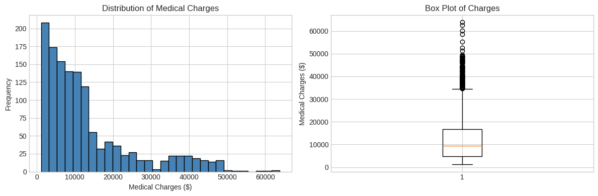
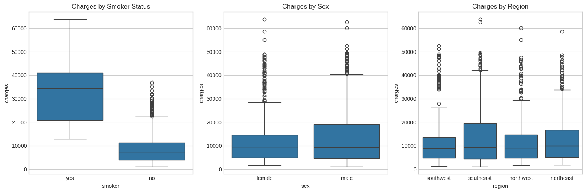
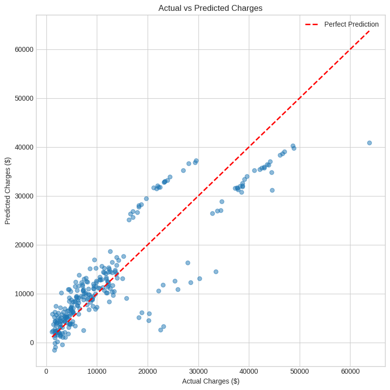
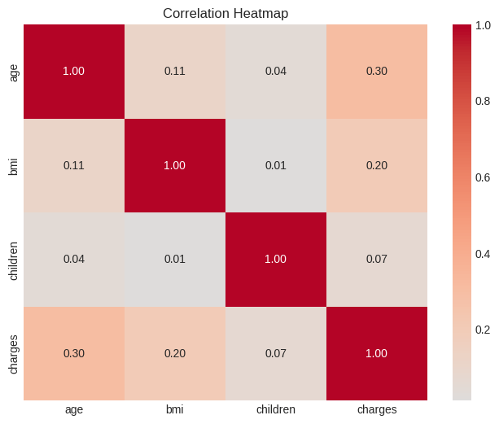
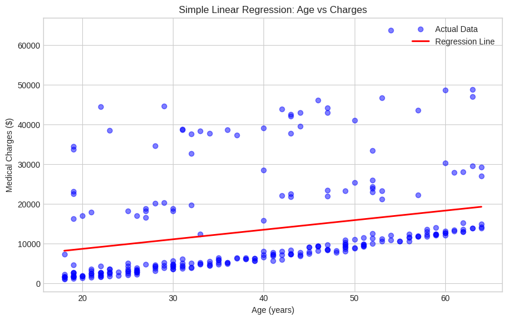
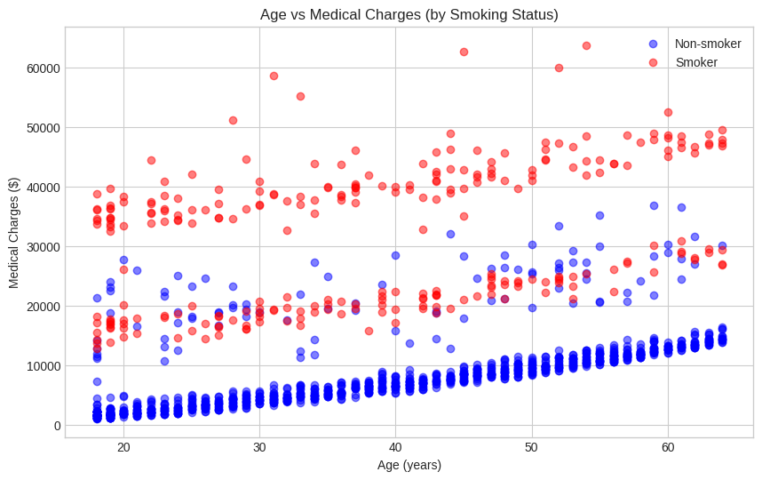
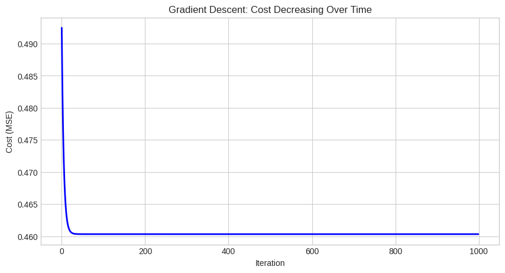

# Medical Cost Estimator Using Supervised Machine Learning

This project focuses on building a supervised machine learning regression model to predict medical insurance charges based on patient-related features. The approach includes exploratory data analysis (EDA), linear regression, and gradient descent to understand patterns in healthcare costs and develop an accurate cost estimation model.

## Overview

Medical insurance costs vary significantly based on individual characteristics. This project builds a predictive model to estimate medical charges using features like age, BMI, smoking status, and more.

### Objectives

- Perform comprehensive Exploratory Data Analysis (EDA)
- Implement Linear Regression from scratch using Gradient Descent
- Build and compare Simple vs Multiple Linear Regression models
- Identify key factors that influence medical costs
- Achieve accurate predictions for insurance charge estimation



  <table>
  <tr>
    <td></td>
    <td></td>
    <td></td>
  </tr>
   <tr>
    <td></td>
    <td></td>
    <td></td>
  </tr>
</table>


## Dataset

**Source:** [Kaggle - Medical Cost Personal Dataset](https://www.kaggle.com/datasets/mirichoi0218/insurance)

| Feature | Description | Type |
|---------|-------------|------|
| `age` | Age of primary beneficiary | Numerical |
| `sex` | Gender (male/female) | Categorical |
| `bmi` | Body Mass Index | Numerical |
| `children` | Number of dependents | Numerical |
| `smoker` | Smoking status (yes/no) | Categorical |
| `region` | US region (northeast, southeast, southwest, northwest) | Categorical |
| `charges` | Medical insurance charges (Target) | Numerical |

### Dataset Statistics

- **Total Records:** 1,338 patients
- **Features:** 6 input features + 1 target
- **Missing Values:** None

---

## Key Findings

### 1. Charges Distribution
- **Right-skewed distribution** with Mean ($13,270) > Median ($9,382)
- Range: $1,121 to $63,770
- Outliers represent genuine high-cost patients (mostly smokers)

### 2. Feature Impact on Charges

| Factor | Impact | Insight |
|--------|--------|---------|
| **Smoking** | **Highest** | Smokers pay ~$23,615 more on average |
| **Age** | Moderate | ~$257 increase per year |
| **BMI** | Moderate | Higher BMI correlates with higher costs |
| **Children** | Low | Minimal impact on charges |
| **Region** | Low | No significant regional variation |

### 3. Correlation Analysis

```
Feature Correlations with Charges:
├── age:      0.30 (Moderate positive)
├── bmi:      0.20 (Weak positive)
├── children: 0.07 (Very weak)
└── smoker:   0.79 (Strong positive - after encoding)
```

---


## 📝 License

This project is licensed under the MIT License - see the [LICENSE](LICENSE) file for details.

---

## 👤 Author

**Rutuja Shingate**

- LinkedIn: [rutujashingate](https://linkedin.com/in/rutujashingate)

---

## Acknowledgments

- Dataset: [Kaggle - Medical Cost Personal Dataset](https://www.kaggle.com/datasets/mirichoi0218/insurance)
- Inspiration: Understanding healthcare cost factors

---

## What I Learned

Through this project, I gained hands-on experience with:

- **Data Analysis:** Cleaning, exploring, and visualizing real-world healthcare data
- **Feature Engineering:** Encoding categorical variables and scaling features
- **Machine Learning:** Implementing linear regression and understanding gradient descent
- **Model Evaluation:** Using metrics like RMSE and R² to assess model performance
- **Python Libraries:** pandas, NumPy, matplotlib, seaborn, scikit-learn

---
